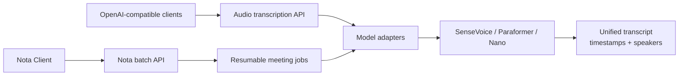

<h1 align="center">Nota ASR Server</h1>

<p align="center">
  <strong>Self-hosted speech-to-text for meetings.</strong>
</p>

<p align="center">
  OpenAI-compatible, speaker-aware, and easy to run on Windows or Docker.<br>
  Built for Nota, usable by any OpenAI-compatible client.
</p>

<p align="center">
  English · <a href="README.zh-CN.md">简体中文</a>
</p>

<p align="center">
  <a href="https://github.com/kwp-lab/nota-asr-server/actions/workflows/tests.yml"></a>
  <a href="https://github.com/kwp-lab/nota-asr-server/actions/workflows/compliance.yml"></a>
  
  
  
  
  
</p>

<p align="center">
  <a href="#quick-start"><strong>Quick start</strong></a>
  ·
  <a href="#windows-portable">Windows portable</a>
  ·
  <a href="#transcribe-with-the-openai-compatible-api">API example</a>
  ·
  <a href="#development">Build from source</a>
</p>

<p align="center">
  
</p>

## Why Nota ASR Server?

Nota ASR Server turns completed meeting recordings into structured transcripts
without requiring a hosted transcription platform. Run it on your Windows PC,
inside Docker, elsewhere on your LAN, or on infrastructure you control.

The service provides the familiar OpenAI audio-transcription endpoint as well
as a resumable protocol for long Nota recordings. SenseVoice, Paraformer, and
Fun-ASR-Nano all pass through model adapters and return one stable response
schema with timestamps and optional meeting-local speaker labels.

Nota ASR Server is the recommended transcription backend for the
[Nota local-first meeting recorder](https://github.com/kwp-lab/nota), but it is
a separate product. Nota Client is not required: any client that can call an
OpenAI-compatible transcription API can use the Server directly.

## Highlights

| | |
|---|---|
| **OpenAI-compatible API** | Use `POST /v1/audio/transcriptions` with existing tools and integrations. |
| **Three ASR models** | Choose SenseVoice, Paraformer SeACo, or Fun-ASR-Nano through stable aliases. |
| **Speaker diarization** | Add meeting-local labels such as `speaker_0` and `speaker_1` with CAM++. |
| **Resumable meeting jobs** | Upload and process long Nota recordings in durable windows that survive normal restarts. |
| **Native Windows Manager** | Configure storage, download and verify models, control the Server, run diagnostics, and follow logs from one GUI. |
| **Self-hosted deployment** | Use a portable Windows Runtime, Docker Compose, a Python environment, or systemd. |
| **Stable model boundary** | Model-specific output is normalized before it reaches API clients. |
| **Optional authentication** | Protect LAN or remote deployments with Bearer API keys. |

## How it works



The OpenAI-compatible endpoint handles one complete upload. Nota's dedicated
batch protocol uploads the original Ogg recording resumably, processes bounded
windows, and then reconciles speakers across the complete meeting. Raw model
output is never exposed as the public contract.

## Choose how to run

| You are... | Recommended path | Development tools required |
|---|---|---|
| A Windows user who wants a GUI | [Portable ZIP + Manager](#windows-portable) | None |
| Running a local or remote container | [Docker Compose](#docker-compose) | Docker |
| Running from a source checkout | [Python source setup](#run-from-source) | Git and Python |
| Modifying the Server or Manager | [Development](#development) | Python; Rust for Manager changes |

The official prebuilt target is Windows 11 x64 with a CPU-only PyTorch Runtime.
Model weights are not bundled in the Runtime, container image, or repository.

<a id="quick-start"></a>

## Quick start

<a id="windows-portable"></a>

### Windows portable package — Recommended

Portable ZIP packages are distributed through
[GitHub Releases](https://github.com/kwp-lab/nota-asr-server/releases). If the
Releases page is empty, use Docker, run from source, or create an owner-local
package with the documented release script.

1. Download `Nota-ASR-Runtime-<version>-Windows-x64-CPU.zip` and extract the
   complete folder to a writable location.
2. Double-click `NotaASRManager.exe`.
3. Confirm the model and data directories. They may be placed on another drive,
   such as `D:\NotaASR`.
4. In the **模型** panel, find **SenseVoiceSmall** and select **下载**. The
   Manager automatically downloads and verifies the required model files.
5. Select **启动 Server** and wait for the header to report that the Server is
   running.

The package does not require a system Python, Git, uv, Rust, Visual Studio,
administrator permission, a Windows service, or a `PATH` change. The Manager
downloads models only after an explicit user action. Its current interface is
Simplified Chinese.

Current portable releases are intentionally unsigned. Windows may show an
unknown-publisher or SmartScreen warning when `NotaASRManager.exe` first runs.
Download only from this repository's GitHub Releases page and compare the ZIP
with the published `.sha256` file:

```powershell
Get-FileHash .\Nota-ASR-Runtime-<version>-Windows-x64-CPU.zip -Algorithm SHA256
```

The checksum verifies file integrity; it is not a publisher identity signature.

The portable configuration binds to `127.0.0.1:8010` by default. The Manager
can change the port, model location, data location, default model, and preload
model. Moving the Runtime does not invalidate an absolute external model path.

### Docker Compose

The current container is CPU-only. Clone the repository, then start it with
Docker Compose:

```bash
git clone https://github.com/kwp-lab/nota-asr-server.git
cd nota-asr-server
docker compose up --build
```

The service is published at `http://127.0.0.1:8010`. The Compose configuration
bind-mounts `./models` and `./data`, so model downloads and unfinished jobs
survive container recreation.

To require an API key or publish a different host port:

```powershell
$env:NOTA_API_KEYS = "replace-with-a-long-random-value"
$env:NOTA_HOST_PORT = "9010"
docker compose up --build
```

See [Operations](docs/operations.md) before deploying beyond one computer and
read the [Security guide](docs/security.md) before exposing the service to an
untrusted network.

### Verify the service

```powershell
Invoke-RestMethod http://127.0.0.1:8010/health
Invoke-RestMethod http://127.0.0.1:8010/ready | ConvertTo-Json
```

`/health` proves that the HTTP process is alive. `/ready` returns HTTP 200 only
after the configured preload model is available. Interactive API documentation
is served at [http://127.0.0.1:8010/docs](http://127.0.0.1:8010/docs).

## Use Nota ASR Server

### Manage the Windows Server

Nota ASR Manager is a native Rust application distributed inside the portable
Runtime. It provides:

- explicit model download, verification, cancellation, and resume;
- Server start, stop, restart, health, and external-process detection;
- editable model, data, port, default-model, and preload-model settings;
- model-directory migration that verifies the destination and preserves the
  source;
- diagnostics for configuration, storage, Runtime versions, models, and ports;
- bounded live logs with filtering and direct access to the log directory;
- a notification-area icon, single-instance behavior, and optional startup
  preferences.

Closing the window keeps the Manager in the notification area. Left-click its
icon to restore the window; right-click for the context menu. Choosing **退出**
stops the Manager-owned Server process cleanly.

<a id="api-example"></a>

### Transcribe with the OpenAI-compatible API

Replace the file path with a real audio recording readable by the installed
audio stack:

```powershell
curl.exe http://127.0.0.1:8010/v1/audio/transcriptions `
  -F "file=@C:\Audio\meeting.wav" `
  -F "model=sensevoice" `
  -F "language=auto" `
  -F "response_format=verbose_json" `
  -F "diarization=true"
```

Use `response_format=json` for a compact `{ "text": "..." }` response.
`verbose_json` schema version `1.0` adds language, duration, processing time,
timestamped segments, and speaker IDs. If authentication is enabled, add:

```powershell
-H "Authorization: Bearer my-local-key"
```

See the versioned [API contract](docs/api-contract.md) for every field, limit,
endpoint, and error response.

### Connect Nota Client

Start the Server, then open **Settings → Speech transcription** in Nota and add
a provider:

| Nota setting | Local Server value |
|---|---|
| Provider type | `FunASR` |
| Base URL | `http://127.0.0.1:8010/v1` |
| Model | `sensevoice` |
| API key | Empty unless Server authentication is enabled |

Use Nota's connection test before transcribing. A Server on another LAN machine
uses that machine's IP address instead of `127.0.0.1`; configure authentication
and firewall access before accepting network connections.

### Models

| Alias | Model | Recommended use | Approximate download | License |
|---|---|---|---:|---|
| `sensevoice` | SenseVoiceSmall | Recommended default for general meeting transcription | 928 MiB | Apache-2.0 |
| `paraformer` | Paraformer SeACo | Chinese meeting transcription with CT-Punc | 2.07 GiB | Apache-2.0 |
| `fun-asr-nano` | Fun-ASR-Nano-2512 | Newer multilingual-model evaluation | 2.03 GiB | Upstream license undeclared |

#### Hotword, context, and weight capabilities

The DashScope column is included for comparison with Nota Client's direct cloud
Provider; DashScope Qwen is not hosted by Nota ASR Server.

| Capability | DashScope Qwen Filetrans | Paraformer SeACo | Fun-ASR-Nano | SenseVoice |
|---|---|---|---|---|
| Plain hotwords | Supported | Supported | Supported | Not supported |
| Arbitrary prompt context | Supported | Not supported | Not exposed; uses a fixed hotword prompt | Not supported |
| Hotword mechanism | Inline `vocabulary` | Decoder bias | LLM hotword prompt | — |
| Per-hotword weight | `1–5` or super-hotword `50` | Not exposed by the current API | Not exposed by the current API | — |

Nota's batch API intentionally accepts `hotwords: string[]`, because adjustable
per-entry weights and arbitrary context do not have equivalent semantics across
the local models. See the [model strategy](docs/model-strategy.md) for the
model-specific mappings and limits.

Download totals include each model's required VAD, punctuation, or CAM++
components. Shared components are reused, so installing another model may need
less additional space. Nano requires an explicit acknowledgement because its
upstream model repository does not currently declare a license.

SenseVoice is the default and preload model. A missing model does not kill the
HTTP process: `/health` remains available while `/ready` explains why the
Server cannot accept inference. See the [model strategy](docs/model-strategy.md)
and [model license guidance](MODEL_LICENSES.md) for revisions and verification
rules.

### Configuration and deployment

Configuration precedence is:

```text
CLI options > process environment > adjacent .env > server.toml > defaults
```

- Portable Runtime configuration lives at `config/server.toml`. Relative paths
  are resolved from that file, and the Manager edits the same TOML atomically.
- Source, Docker, and systemd deployments continue to support `.env` and every
  existing `NOTA_*` environment variable.
- API keys are accepted only through the process environment or `.env`; the
  Manager never writes them into ordinary TOML.
- The portable Runtime defaults to loopback. Source and Docker examples bind to
  `0.0.0.0` so LAN/container access works; use authentication and firewall rules
  for any network-facing deployment.

Changing the port, model root, default model, or preload model requires a Server
restart. The complete configuration, storage, CLI, logging, recovery, and
systemd reference is in [Operations](docs/operations.md).

<a id="development"></a>

## Development

### Prerequisites

- Git
- Python 3.10, 3.11, or 3.12
- Internet access for Python packages and explicit model downloads
- Rust 1.96.0 with the MSVC toolchain for Manager changes
- Windows 11 x64 and uv 0.9.2 for the self-contained Windows Runtime build

### Run from source

The following CPU setup works in Windows PowerShell and uses an editable
installation:

```powershell
git clone https://github.com/kwp-lab/nota-asr-server.git
Set-Location .\nota-asr-server

py -3.12 -m venv .venv
.\.venv\Scripts\python.exe -m pip install --upgrade pip setuptools wheel
.\.venv\Scripts\python.exe -m pip install `
  torch torchaudio --index-url https://download.pytorch.org/whl/cpu
.\.venv\Scripts\python.exe -m pip install -e ".[dev]"

Copy-Item .env.example .env
.\.venv\Scripts\nota-asr-server.exe
```

The source configuration preloads SenseVoice and uses on-demand model download
for backward compatibility. Edit `.env` before startup to change the host,
device, model aliases, storage, limits, or authentication. Do not commit `.env`.

Linux uses the same Python versions and package order with the platform's venv
commands. An optional PyTorch XPU environment for compatible Intel GPUs is
documented in [Operations](docs/operations.md); CPU remains the official
prebuilt baseline.

### Tests and quality checks

Python tests use fake backends and do not download model weights:

```powershell
.\.venv\Scripts\python.exe -m pytest
```

Manager changes also require:

```powershell
cargo fmt --all -- --check
cargo test --workspace --locked
cargo clippy --workspace --all-targets --locked -- -D warnings
```

### Project structure

```text
src/        Python API, configuration, model adapters, and job processing
manager/    Native Rust Windows Manager
scripts/    Runtime, compliance, benchmark, and local release tooling
tests/      API-contract and behavior tests with fake model backends
deploy/     Docker, systemd, and portable Windows templates
docs/       Architecture, API, operations, security, model strategy, and ADRs
```

### Build the Windows Runtime

Create an unpacked one-folder Runtime for local development and inspection:

```powershell
.\scripts\build-windows-runtime.ps1 `
  -OutputDirectory .\dist\nota-asr-runtime `
  -PreloadModel sensevoice
```

This output intentionally excludes the Manager and ZIP. The owner-local release
entry point builds the Runtime and Manager, generates Windows-specific legal
artifacts, performs offline checks, and packages one ZIP. The current public
portable release policy is explicitly unsigned:

```powershell
.\scripts\build-windows-release.ps1 -Configuration Release -UnsignedRelease
```

It creates `Nota-ASR-Runtime-<version>-Windows-x64-CPU.zip` under ignored
`dist/`. It does not upload files, create a Git tag or GitHub Release, download
model weights, or run in CI. The build also emits a `.sha256` file and release
manifest that record the exact artifact bytes and unsigned signature policy.
Omit `-UnsignedRelease` only after configuring an Authenticode certificate via
`NOTA_SIGN_CERT_SHA1` or `NOTA_SIGN_PFX_PATH`.

### Engineering documentation

Start with [CONTRIBUTING.md](CONTRIBUTING.md), then use the
[engineering documentation index](docs/README.md):

- [Business context](docs/business-context.md)
- [API contract](docs/api-contract.md)
- [Architecture](docs/architecture.md)
- [Model strategy](docs/model-strategy.md)
- [Development guide](docs/development.md)
- [Operations](docs/operations.md)
- [Security](docs/security.md)
- [Open-source compliance](docs/open-source-compliance.md)

## Current scope

- Completed recordings only; realtime and streaming ASR are not implemented.
- One inference slot by default.
- Windows 11 x64 CPU is the only official prebuilt target.
- Intel XPU is an optional source-install path, not an official portable build.
- Models are always downloaded separately and may have independent licenses.
- The current native Manager interface is Simplified Chinese.

## License

Nota ASR Server is licensed under the [MIT License](LICENSE). Copyright (c) 2026 kwp-lab.

Third-party packages and models retain their own licenses. See the
[dependency inventory](THIRD_PARTY_LICENSES.md),
[complete notices](THIRD_PARTY_NOTICES.txt), [CycloneDX SBOM](bom.cyclonedx.json),
and [model license guidance](MODEL_LICENSES.md).
