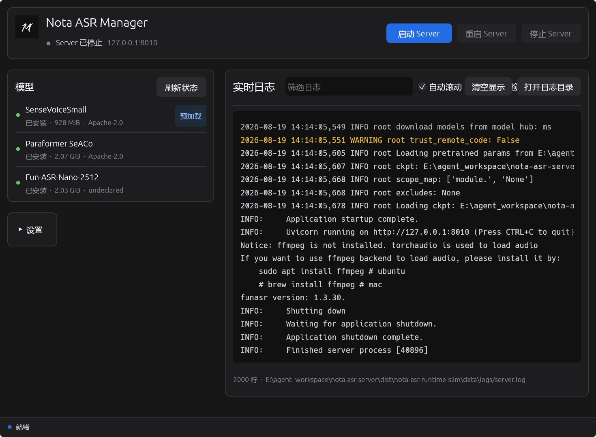
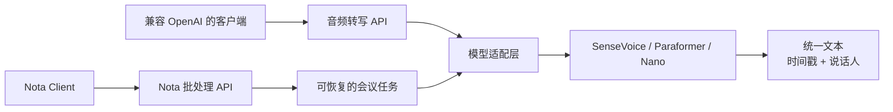

<h1 align="center">Nota ASR Server</h1>

<p align="center">
  <strong>面向会议录音的自托管语音转文字服务。</strong>
</p>

<p align="center">
  兼容 OpenAI API，支持说话人分离，可通过 Windows 便携包或 Docker 轻松运行。<br>
  为 Nota 深度适配，也可以被任何兼容 OpenAI 转写接口的客户端调用。
</p>

<p align="center">
  <a href="README.md">English</a> · 简体中文
</p>

<p align="center">
  <a href="https://github.com/kwp-lab/nota-asr-server/actions/workflows/tests.yml"></a>
  <a href="https://github.com/kwp-lab/nota-asr-server/actions/workflows/compliance.yml"></a>
  
  
  
  
  
</p>

<p align="center">
  <a href="#quick-start"><strong>快速开始</strong></a>
  ·
  <a href="#windows-portable">Windows 便携包</a>
  ·
  <a href="#api-example">API 示例</a>
  ·
  <a href="#development">从源码构建</a>
</p>

<p align="center">
  
</p>

## 为什么选择 Nota ASR Server？

Nota ASR Server 可以把已经录制完成的会议音频转成结构化文本，不要求依赖托管式
转写平台。你可以把它运行在自己的 Windows 电脑、Docker、局域网中的另一台机器，
或者完全由自己控制的服务器上。

服务端同时提供常见的 OpenAI 音频转写接口和面向 Nota 长录音的可恢复协议。
SenseVoice、Paraformer 和 Fun-ASR-Nano 都会经过统一的模型适配层，向调用方返回
稳定的响应结构、时间戳和可选的会议内说话人标签。

Nota ASR Server 是
[Nota 本地优先会议录音客户端](https://github.com/kwp-lab/nota)推荐使用的转写后端，
但它是一个可以独立安装、运行和升级的产品。不安装 Nota Client 也可以使用；任何
能够调用兼容 OpenAI 转写接口的客户端都可以直接连接它。

## 核心能力

| | |
|---|---|
| **兼容 OpenAI API** | 可通过 `POST /v1/audio/transcriptions` 接入现有工具和应用。 |
| **三种 ASR 模型** | 通过稳定别名使用 SenseVoice、Paraformer SeACo 或 Fun-ASR-Nano。 |
| **说话人分离** | 通过 CAM++ 输出 `speaker_0`、`speaker_1` 等会议内匿名标签。 |
| **可恢复的会议任务** | 长录音分窗口处理，上传和推理进度可在正常重启后继续。 |
| **原生 Windows Manager** | 在一个 GUI 中配置目录、安装模型、控制 Server、诊断问题和查看日志。 |
| **自托管部署** | 支持 Windows 便携 Runtime、Docker Compose、Python 环境和 systemd。 |
| **稳定的模型边界** | 不把不同模型的原始输出直接暴露给 API 调用方。 |
| **可选身份验证** | 可通过 Bearer API Key 保护局域网或远程部署。 |

## 工作方式



兼容 OpenAI 的接口处理单次完整文件上传。Nota 专用协议会断点续传原始 Ogg
录音，以有限长度的窗口执行推理，最后在整场会议范围内统一说话人标签。模型原始
输出不会直接成为公开 API 契约。

## 选择运行方式

| 你的需求 | 推荐方式 | 是否需要开发环境 |
|---|---|---|
| 普通 Windows 用户，希望通过 GUI 管理 | [便携 ZIP + Manager](#windows-portable) | 不需要 |
| 在本地或远程运行容器 | [Docker Compose](#docker-compose) | 需要 Docker |
| 从源码直接运行 Server | [Python 源码环境](#run-from-source) | 需要 Git 和 Python |
| 修改 Server 或 Manager | [开发与二次开发](#development) | 需要 Python；修改 Manager 还需要 Rust |

官方预构建目标只提供 Windows 11 x64、CPU 版 PyTorch Runtime。模型权重不会
进入 Runtime、容器镜像或 Git 仓库。

<a id="quick-start"></a>

## 快速开始

<a id="windows-portable"></a>

### Windows 便携包——推荐

便携 ZIP 通过
[GitHub Releases](https://github.com/kwp-lab/nota-asr-server/releases) 发布。
如果 Releases 页面暂时没有产物，请使用 Docker、从源码运行，或者通过文档中的
本地发布脚本构建 owner 自用包。

1. 下载 `Nota-ASR-Runtime-<version>-Windows-x64-CPU.zip`，将完整目录解压到
   一个可写位置。
2. 双击 `NotaASRManager.exe`。
3. 确认模型目录和数据目录；它们可以放到 `D:\NotaASR` 等其他磁盘。
4. 在 **模型** 面板找到 **SenseVoiceSmall**，点击 **下载**。Manager 会自动下载并
   校验所需模型文件。
5. 点击 **启动 Server**，等待顶部状态变为 Server 正在运行。

目标电脑不需要安装系统 Python、Git、uv、Rust、Visual Studio，也不需要管理员
权限；程序不会注册 Windows 服务或修改 `PATH`。只有用户明确点击安装后 Manager
才会下载模型。Manager 当前提供简体中文界面。

当前便携版有意不进行代码签名。首次运行 `NotaASRManager.exe` 时，Windows 可能显示
“未知发布者”或 SmartScreen 提示。请只从本仓库的 GitHub Releases 页面下载，并将
ZIP 与同时发布的 `.sha256` 文件进行比对：

```powershell
Get-FileHash .\Nota-ASR-Runtime-<version>-Windows-x64-CPU.zip -Algorithm SHA256
```

SHA-256 用于确认文件内容没有变化，不代表发布者身份签名。

便携版默认监听 `127.0.0.1:8010`。你可以在 Manager 中修改端口、模型目录、数据
目录、默认模型和预加载模型。使用绝对路径配置外置模型目录后，移动 Runtime 不会
影响已有模型的复用。

### Docker Compose

当前容器只提供 CPU 运行环境。克隆仓库后通过 Docker Compose 启动：

```bash
git clone https://github.com/kwp-lab/nota-asr-server.git
cd nota-asr-server
docker compose up --build
```

服务会发布到 `http://127.0.0.1:8010`。Compose 将 `./models` 和 `./data`
挂载到容器中，因此重建容器不会丢失模型下载和未完成任务。

如需设置 API Key 或修改宿主机端口：

```powershell
$env:NOTA_API_KEYS = "replace-with-a-long-random-value"
$env:NOTA_HOST_PORT = "9010"
docker compose up --build
```

跨电脑部署前请阅读[运维文档](docs/operations.md)；向不受信任的网络开放服务前，
请阅读[安全指南](docs/security.md)。

### 验证服务

```powershell
Invoke-RestMethod http://127.0.0.1:8010/health
Invoke-RestMethod http://127.0.0.1:8010/ready | ConvertTo-Json
```

`/health` 用来确认 HTTP 进程存活。只有配置的预加载模型已经可用时，`/ready`
才会返回 HTTP 200。启动后还可以访问
[http://127.0.0.1:8010/docs](http://127.0.0.1:8010/docs) 查看交互式 API 文档。

## 使用 Nota ASR Server

### 通过 Manager 管理 Windows Server

Nota ASR Manager 是随便携 Runtime 分发的原生 Rust 应用，提供：

- 显式下载、校验、取消和续传模型；
- 启动、停止、重启 Server，并检查健康状态和识别外部进程；
- 配置模型目录、数据目录、端口、默认模型和预加载模型；
- 将已有模型迁移到新目录，验证目标文件并保留原目录；
- 诊断配置、存储空间、Runtime 版本、模型状态和端口占用；
- 实时查看有限行数的 Server 日志、筛选内容并打开日志目录；
- 单实例、系统托盘以及可选的登录后启动行为。

关闭窗口后 Manager 会继续驻留在系统托盘。左击图标可以恢复窗口，右击打开菜单；
选择 **退出** 时会正常停止由 Manager 启动的 Server 子进程。

<a id="api-example"></a>

### 通过兼容 OpenAI 的 API 转写

将下面路径替换成音频环境能够读取的真实录音文件：

```powershell
curl.exe http://127.0.0.1:8010/v1/audio/transcriptions `
  -F "file=@C:\Audio\meeting.wav" `
  -F "model=sensevoice" `
  -F "language=auto" `
  -F "response_format=verbose_json" `
  -F "diarization=true"
```

设置 `response_format=json` 会返回精简的 `{ "text": "..." }`。版本为 `1.0`
的 `verbose_json` 还会包含语言、音频时长、处理时间、带时间戳的分段和说话人 ID。
如果服务端启用了身份验证，再添加：

```powershell
-H "Authorization: Bearer my-local-key"
```

全部字段、限制、端点和错误响应以版本化的 [API 契约](docs/api-contract.md)为准。

### 连接 Nota Client

先启动 Server，然后在 Nota 中打开 **设置 → 语音转写** 并添加 Provider：

| Nota 配置项 | 本机 Server 配置 |
|---|---|
| Provider 类型 | `FunASR` |
| Base URL | `http://127.0.0.1:8010/v1` |
| 模型 | `sensevoice` |
| API Key | 未启用 Server 身份验证时留空 |

开始转写前请先使用 Nota 的连接测试。Server 位于局域网另一台电脑时，应把
`127.0.0.1` 替换成那台电脑的 IP，并在接受网络连接前配置身份验证和防火墙规则。

### 模型

| 别名 | 模型 | 推荐用途 | 预计下载量 | 许可证 |
|---|---|---|---:|---|
| `sensevoice` | SenseVoiceSmall | 推荐默认模型，适合通用会议转写 | 928 MiB | Apache-2.0 |
| `paraformer` | Paraformer SeACo | 中文会议转写，并使用 CT-Punc | 2.07 GiB | Apache-2.0 |
| `fun-asr-nano` | Fun-ASR-Nano-2512 | 用于评估较新的多语言模型 | 2.03 GiB | 上游未声明 |

#### 热词、上下文与权重能力

下表加入 DashScope，是为了与 Nota Client 直连的云端 Provider 对比；Nota ASR
Server 本身不托管千问模型。

| 能力 | DashScope 千问 Filetrans | Paraformer SeACo | Fun-ASR-Nano | SenseVoice |
|---|---|---|---|---|
| 普通热词 | 支持 | 支持 | 支持 | 不支持 |
| 任意 Prompt 上下文 | 支持 | 不支持 | 未开放；内部使用固定热词 Prompt | 不支持 |
| 热词实现 | 即时 `vocabulary` | 解码器偏置 | LLM 热词提示 | — |
| 每条热词可调权重 | `1–5` 或超级热词 `50` | 当前 API 未开放 | 当前 API 未开放 | — |

Nota 批处理 API 有意只接收 `hotwords: string[]`，因为逐条权重和任意上下文在
本地模型之间没有等价语义。各模型的映射和限制参见[模型策略](docs/model-strategy.md)。

下载量包含模型所需的 VAD、标点或 CAM++ 组件。已经安装的公共组件会被复用，
因此继续安装其他模型时，实际新增下载量可能更小。Nano 的上游模型仓库目前没有
明确声明许可证，因此安装前必须由用户显式确认。

SenseVoice 是默认模型和预加载模型。缺少模型不会导致 HTTP 进程退出：`/health`
仍然可用，`/ready` 会解释 Server 暂时无法执行推理的原因。模型 revision 和校验
规则参见[模型策略](docs/model-strategy.md)和[模型许可证说明](MODEL_LICENSES.md)。

### 配置与部署

配置优先级为：

```text
命令行参数 > 进程环境变量 > 配置文件旁的 .env > server.toml > 程序默认值
```

- 便携 Runtime 使用 `config/server.toml`。相对路径以该文件为基准，Manager 会
  以原子替换方式编辑同一份 TOML。
- 源码、Docker 和 systemd 部署继续兼容 `.env` 及现有的全部 `NOTA_*` 环境变量。
- API Key 只通过进程环境变量或 `.env` 提供；Manager 不会把它写进普通 TOML。
- 便携 Runtime 默认只监听本机。源码和 Docker 示例使用 `0.0.0.0`，以便局域网
  或容器访问；任何面向网络的部署都应该配置身份验证和防火墙规则。

修改端口、模型根目录、默认模型或预加载模型后需要重启 Server。完整的配置、
存储、CLI、日志、恢复和 systemd 说明参见[运维文档](docs/operations.md)。

<a id="development"></a>

## 开发与二次开发

### 开发环境

- Git
- Python 3.10、3.11 或 3.12
- 首次安装 Python 依赖和显式下载模型所需的网络连接
- 修改 Manager 需要 Rust 1.96.0 和 MSVC 工具链
- 构建自包含 Windows Runtime 需要 Windows 11 x64 和 uv 0.9.2

<a id="run-from-source"></a>

### 从源码运行

下面的 CPU 安装方式适用于 Windows PowerShell，并使用 editable install：

```powershell
git clone https://github.com/kwp-lab/nota-asr-server.git
Set-Location .\nota-asr-server

py -3.12 -m venv .venv
.\.venv\Scripts\python.exe -m pip install --upgrade pip setuptools wheel
.\.venv\Scripts\python.exe -m pip install `
  torch torchaudio --index-url https://download.pytorch.org/whl/cpu
.\.venv\Scripts\python.exe -m pip install -e ".[dev]"

Copy-Item .env.example .env
.\.venv\Scripts\nota-asr-server.exe
```

为了保持兼容性，源码配置默认预加载 SenseVoice，并允许在请求时下载模型。启动前
可以编辑 `.env` 修改监听地址、设备、模型别名、存储路径、限制和身份验证。不要
提交 `.env`。

Linux 支持相同的 Python 版本和依赖安装顺序，只需使用对应平台的 venv 命令。
兼容 Intel GPU 的 PyTorch XPU 环境记录在[运维文档](docs/operations.md)中；CPU
仍然是官方预构建版本的基线。

### 测试与质量检查

Python 自动化测试使用假模型后端，不会下载模型权重：

```powershell
.\.venv\Scripts\python.exe -m pytest
```

修改 Manager 后还需要运行：

```powershell
cargo fmt --all -- --check
cargo test --workspace --locked
cargo clippy --workspace --all-targets --locked -- -D warnings
```

### 工程结构

```text
src/        Python API、配置、模型适配器和任务处理
manager/    原生 Rust Windows Manager
scripts/    Runtime、合规、基准测试和本地发布工具
tests/      使用假模型后端的 API 契约与行为测试
deploy/     Docker、systemd 和 Windows 便携版模板
docs/       架构、API、运维、安全、模型策略和 ADR
```

### 构建 Windows Runtime

为本地开发和检查生成未压缩的 one-folder Runtime：

```powershell
.\scripts\build-windows-runtime.ps1 `
  -OutputDirectory .\dist\nota-asr-runtime `
  -PreloadModel sensevoice
```

这个产物有意不包含 Manager 和 ZIP。owner 的本地发布入口会构建 Runtime 与
Manager、生成 Windows 专用合规文件、执行离线检查并生成一个 ZIP。当前公开便携版
采用明确选择的无签名发布策略：

```powershell
.\scripts\build-windows-release.ps1 -Configuration Release -UnsignedRelease
```

产物为忽略目录 `dist/` 下的
`Nota-ASR-Runtime-<version>-Windows-x64-CPU.zip`。脚本不会上传文件、创建 Git
tag 或 GitHub Release、下载模型权重，也不会在 CI 中运行。构建同时生成 `.sha256`
文件和 release manifest，记录准确的产物指纹及无签名策略。以后配置
`NOTA_SIGN_CERT_SHA1` 或 `NOTA_SIGN_PFX_PATH` 后，可以省略 `-UnsignedRelease` 来生成
Authenticode 签名版本。

### 工程文档

请先阅读 [CONTRIBUTING.md](CONTRIBUTING.md)，然后通过
[工程文档索引](docs/README.md)继续了解：

- [业务上下文](docs/business-context.md)
- [API 契约](docs/api-contract.md)
- [架构](docs/architecture.md)
- [模型策略](docs/model-strategy.md)
- [开发指南](docs/development.md)
- [运维](docs/operations.md)
- [安全](docs/security.md)
- [开源合规](docs/open-source-compliance.md)

## 当前范围

- 只处理已完成的录音；暂不提供实时或流式 ASR。
- 默认只有一个推理并发槽位。
- Windows 11 x64 CPU 是唯一官方预构建目标。
- Intel XPU 是可选的源码安装方式，不提供官方便携包。
- 模型始终单独下载，并可能具有独立许可证。
- 原生 Manager 当前只提供简体中文界面。

## 许可证

Nota ASR Server 使用 [MIT License](LICENSE)。Copyright (c) 2026 kwp-lab。

第三方依赖和模型保留各自的许可证。请查看
[依赖清单](THIRD_PARTY_LICENSES.md)、[完整通知](THIRD_PARTY_NOTICES.txt)、
[CycloneDX SBOM](bom.cyclonedx.json)和[模型许可证说明](MODEL_LICENSES.md)。
