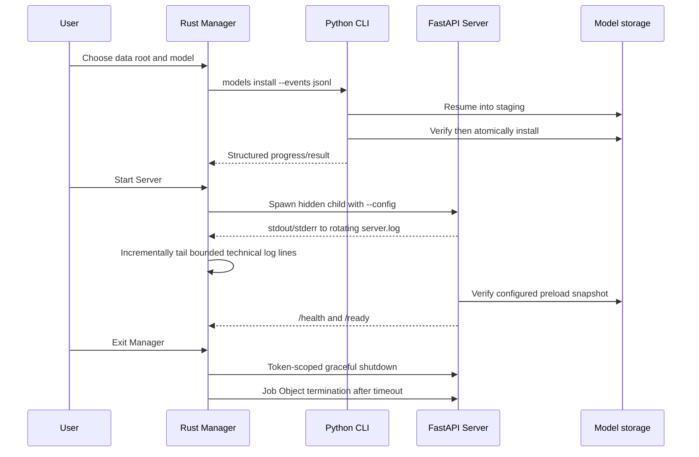

# Architecture

## Request Flow

```text
Windows client
    -> FastAPI route and optional Bearer authentication
    -> resumable Ogg upload and SQLite job state
    -> media duration probe and policy validation after upload completion
    -> bounded five-minute 16 kHz processing windows
    -> ModelManager concurrency gate
    -> SenseVoiceBackend, ParaformerBackend, or FunAsrNanoBackend
    -> FunASR AutoModel + FSMN-VAD + CAM++ centers and private chunk traces
    -> meeting-wide clustering + token-aligned speaker turns + overlap merge
    -> model-independent normalizer
    -> versioned API response
    -> client acknowledgement or 24-hour expiry cleanup
```

## Ownership Boundaries

- API routes own HTTP validation and response selection.
- Audio storage owns bounded disk spooling, probing, and cleanup.
- The batch job service owns SQLite durability, sequential upload offsets,
  restart recovery, cancellation, processing windows, and final assembly.
- ModelManager owns allowlisting, lazy loading, and inference concurrency.
- Backends own FunASR model configuration and model-specific language hints.
- The model manager maps `NOTA_MODEL_DIR` to ModelScope's process-wide cache
  before any FunASR model is loaded.
- The versioned model catalog owns aliases, complete upstream identifiers,
  revisions, expected files, licenses, download sizes, and mutable-snapshot
  digests. Backends receive resolved local paths or legacy upstream references;
  they do not define a second catalog.
- `server.toml` is the Windows Runtime configuration source of truth. The
  command-line layer constructs one `Settings` instance and passes it to
  `create_app()`; FastAPI must not independently reload environment settings.
- The Windows Manager owns only user interaction and the lifecycle of the
  Server child it started. It calls the Python CLI for configuration validation,
  model operations, and diagnosis, incrementally follows the child's bounded
  technical `server.log`, and never becomes part of the public HTTP API contract.
- The short-recording cluster adapter owns the FunASR `<20` embedding
  compatibility behavior and captures CAM++ traces during VAD-mode batch
  inference as documented in `model-strategy.md`.
- The batch finalizer owns meeting-wide speaker prototypes, stable turn
  smoothing, guarded token-boundary splitting, and VAD-level fallback.
- The meeting speaker clusterer owns deterministic cosine clustering for sparse
  per-window centroids; it does not reuse FunASR's dense-embedding sample-count
  switch.
- Normalization owns the public response semantics.
- Pydantic schemas are the executable API contract.
- The speaker-embedding backend owns lazy CAM++ loading and normalized vector
  extraction plus bounded multi-clip purity analysis. Its route owns strict
  WAV validation and request-scoped cleanup; it is independent of transcription
  and durable job state.

Raw FunASR dictionaries must not cross the normalization boundary.

## Windows product lifecycle



`/health` remains available when a configured model is absent. `/ready` remains
the existing stable schema and returns HTTP 503 with a readiness detail until
the preload model is installed and loaded.

Fun-ASR-Nano uses the same bounded job and speaker pipeline. FSMN-VAD keeps
Nano inputs at no more than 30 seconds, Nano emits text and timestamps, and
CAM++ emits private centroids and, for VAD-mode models, a compact chunk trace
consumed by meeting-wide finalization. Both remain internal to the server.

The OpenAI-compatible endpoint retains its original synchronous temporary-file
flow. The `/v1/nota` job API is additive and returns the same
`VerboseTranscription` schema only from its final result endpoint.

`POST /v1/nota/speaker-embeddings` is a second additive flow. It passes one
bounded, validated voice sample through the same process-wide inference gate,
returns an anonymous L2-normalized CAM++ vector, and deletes the upload. It
does not read or write the batch-job database.

`POST /v1/nota/speaker-samples/analyze` is the conservative enrollment flow.
It clusters bounded candidates that the client already grouped under one
anonymous label, checks within-candidate CAM++ window stability, and removes
uncertain boundaries and short turns. It returns either enrollable clean ranges
and an embedding or a preview-only result with no embedding. It never edits or
regenerates a transcript.

## Concurrency

Model loading is protected by a lock. Each backend serializes calls to its
`AutoModel` instance, and the manager applies a process-wide inference
semaphore. The default is one concurrent inference because the initial target
is a CPU host and FunASR pipelines are stateful.

The job worker commits each completed window before starting the next one.
After a restart, a processing job is requeued and resumes from its last
committed window. Cancellation is observed between windows.
