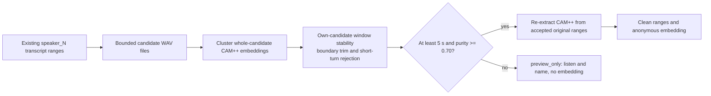

# ADR 0008: Filter Voiceprint Samples Independently From Transcription

- Status: Accepted
- Date: 2026-08-03
- Last updated: 2026-08-03

## Context

One transcript segment can contain rapid turns from multiple people even when
CAM++ detects an internal speaker change. Reusing the whole transcript segment
for enrollment can therefore contaminate a persistent client-local voiceprint.
Changing stable transcription segmentation is outside this feature's scope.

## Decision

Add a stateless, user-triggered multi-candidate analysis endpoint. Nota groups
bounded candidates by the existing anonymous `speaker_N` label. The server
first clusters whole-candidate CAM++ embeddings, then compares sliding windows
with their own dominant candidate, trims uncertain change boundaries, and
rejects short or ambiguous turns. It recomputes the voiceprint from only
accepted original-audio ranges. When the biometric gates fail, it still returns
a bounded preview for manual listening but never returns an embedding.

The server receives no names or recording ids, stores no biometric data, and
does not read or modify transcription jobs.

## Consequences

- Enrollment favors missing data over a polluted long-lived voiceprint.
- Manual preview and meeting-local naming remain available when enrollment is
  rejected.
- Very short turns and overlapping speech are intentionally ignored.
- CAM++ boundaries are approximate; safety trimming reduces usable duration.
- The existing single-sample embedding endpoint remains compatible.
