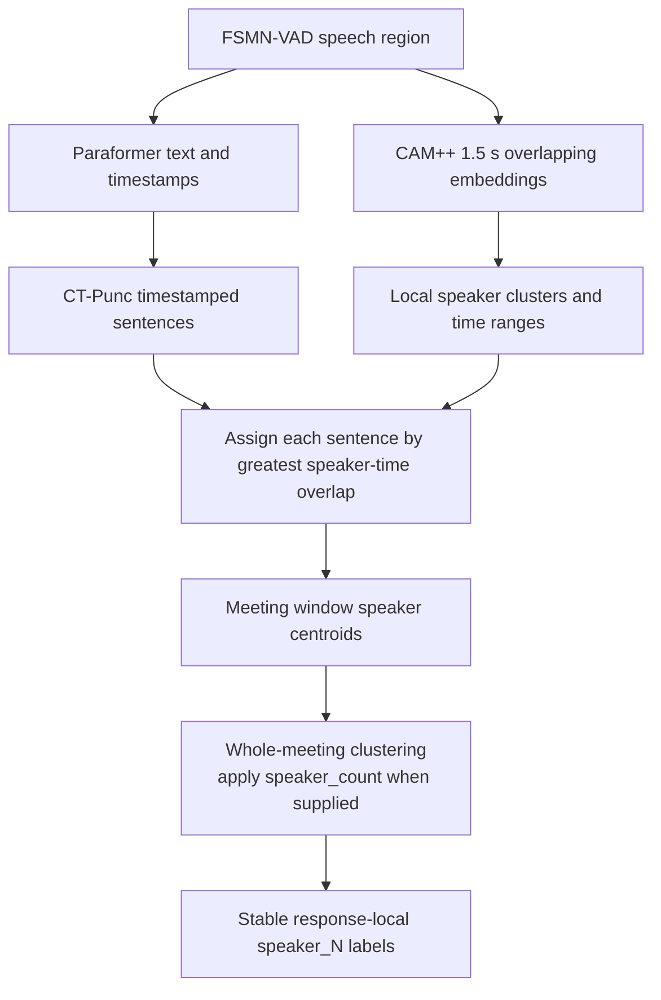

# ADR 0009: Map Paraformer Speakers to Punctuation Sentences

- Status: Accepted
- Date: 2026-08-04
- Last updated: 2026-08-04

## Context

FSMN-VAD can produce a continuous region as long as 30 seconds. Several people
may take turns inside that region without enough silence to create another VAD
boundary. CAM++ still detects speaker changes in its overlapping 1.5-second
windows, but `spk_mode=vad_segment` assigns only one dominant speaker to the
entire region.

Paraformer already loads CT-Punc and produces timestamps that FunASR can use to
create sentence boundaries. SenseVoice and Fun-ASR-Nano use native punctuation
and do not expose the same external punctuation result expected by FunASR's
`punc_segment` path.

## Decision

Use `spk_mode=punc_segment` only for Paraformer. Keep SenseVoice and
Fun-ASR-Nano on `vad_segment`. CAM++ extraction and clustering remain
unchanged; only the boundaries receiving the final speaker labels differ.

For durable batch jobs, a known `speaker_count` is applied only during final
whole-meeting centroid clustering. It is not forced into each processing
window because a window may contain only a subset of the meeting participants.

## Consequences

- Rapid turns separated by predicted punctuation can receive different
  speaker labels inside one VAD region.
- Incorrect punctuation can still merge turns or create short sentence
  fragments.
- Simultaneous speech and speaker changes inside one predicted sentence remain
  unresolved.
- A correct `speaker_count` reduces over- or under-clustering but cannot create
  usable embeddings for extremely short speech.
- The requested count is bounded by the number of available whole-meeting
  centroids. A meeting can therefore return fewer speakers than requested when
  there are not enough valid speaker centers to support that many clusters.
- The public transcription response schema remains unchanged; Paraformer may
  return more segments with different boundaries.
