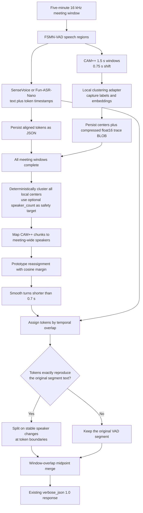

# ADR 0010: Refine VAD Segments with CAM++ Turns and ASR Token Timestamps

- Status: Accepted
- Date: 2026-08-04
- Last updated: 2026-08-04

## Context

SenseVoice and Fun-ASR-Nano intentionally use `spk_mode=vad_segment` because
they provide native punctuation rather than the CT-Punc result expected by
FunASR's `punc_segment` path. A VAD region may nevertheless contain several
rapid speaker turns. FunASR already extracts overlapping CAM++ embeddings for
that region, but its standard adapter assigns only the speaker with the
greatest total overlap to the complete VAD segment.

The ASR models also return token or word timestamps. The server can therefore
recover a finer speaker timeline without loading another model or changing the
public transcription contract.

## Decision

For durable Nota batch jobs using SenseVoice or Fun-ASR-Nano, capture the
CAM++ input embeddings and local cluster labels inside the existing clustering
adapter. Preserve `spk_mode=vad_segment`; this is a server-owned finalization
refinement, not a change to FunASR model configuration.

Whole-meeting clustering remains authoritative. A local CAM++ chunk first
inherits the global cluster assigned to its local center. It may move to a
different meeting-wide prototype only when cosine similarity improves by at
least `0.05`; this prevents low-confidence nearest-centroid flicker. Adjacent
turns shorter than `0.7` seconds are absorbed into the nearest stable speaker.
The associated transcript text is retained.

The server splits a segment only when concatenating its aligned token text,
ignoring whitespace, exactly reproduces the normalized ASR segment. Any
alignment mismatch uses the original segment and speaker mapping. This guard
makes text preservation more important than finer diarization.

CAM++ traces are committed with each completed processing window. Embeddings
are stored as compressed float16 arrays in SQLite; timestamps, local labels,
and shapes are validated when restored. Token metadata is stored separately as
JSON. A restart can therefore resume finalization without rerunning completed
windows. Existing checkpoints without these fields remain valid and use the
original VAD-level behavior.

## Consequences

- Rapid non-overlapping turns can produce multiple final segments inside one
  SenseVoice or Fun-ASR-Nano VAD region.
- The change adds no ASR, VAD, punctuation, or speaker-model inference.
- The synchronous OpenAI-compatible endpoint keeps native FunASR segmentation;
  refinement is scoped to whole-meeting batch finalization.
- The response schema, anonymous `speaker_N` semantics, API capability version,
  and client storage schema do not change.
- Historical transcripts do not change automatically; retranscription creates
  a new result using this refinement.
- Turn resolution is bounded by CAM++'s 1.5-second overlapping windows and ASR
  timestamp quality. Extremely short turns are deliberately attributed to a
  neighboring stable speaker, but their text is never discarded.
- Simultaneous speakers still cannot be represented by the single-speaker
  segment schema.
- If a model omits a trace, timestamps, or an exact surface-text alignment, the
  server returns the safe VAD-level result instead of guessing.

## Alternatives Considered

- **Set `spk_mode=punc_segment` for every model.** Rejected because SenseVoice
  and Nano do not use the CT-Punc result required by that FunASR path.
- **Run CAM++ a second time after transcription.** Rejected because the needed
  embeddings already exist and extra inference would waste compute.
- **Split text proportionally by time.** Rejected because it can move or lose
  characters when speech rate and token timing differ.
- **Return raw CAM++ traces to Nota.** Rejected because diarization assembly is
  server-owned and raw model output must not expand the public API contract.
