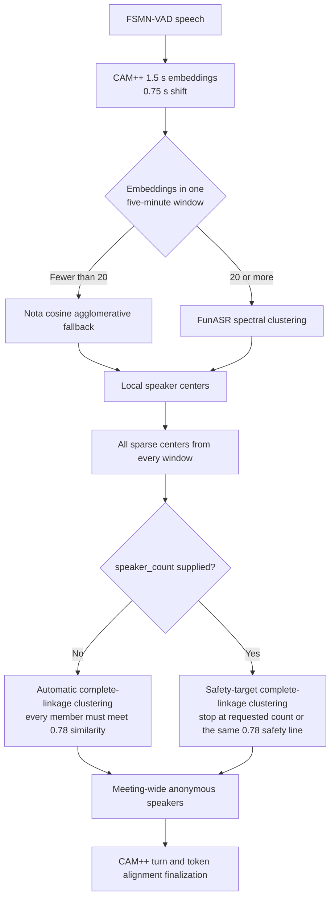

# ADR 0011: Separate Local CAM++ Clustering from Meeting-Centroid Clustering

- Status: Accepted
- Date: 2026-08-04
- Last updated: 2026-08-04

## Context

FunASR's CAM++ clustering backend is designed for dense sequences of
overlapping 1.5-second embeddings. It returns one speaker below 20 embeddings
and switches to spectral clustering at 20 or more. Nota previously reused that
same sample-count rule when clustering sparse per-window speaker centroids at
whole-meeting finalization.

Those inputs have different semantics. A five-minute window can contain
hundreds of chronological CAM++ embeddings, while a complete meeting may have
only a few centroids per real participant. Crossing 20 meeting centroids does
not make that sparse set suitable for spectral graph construction or random
K-means assignment.

In a controlled meeting, five windows produced 23 local centroids. Automatic
spectral clustering estimated eight speakers and merged two window centroids
whose cosine similarity was only 0.545. Repeating K-means with the same speaker
count did not always preserve that assignment.

## Decision

Use separate algorithms for the two clustering levels.

Window-local clustering retains the existing FunASR behavior for dense inputs
and Nota's short-input fallback. Whole-meeting centroid clustering never calls
the FunASR spectral backend and never switches algorithms at 20 samples.

Automatic whole-meeting clustering uses cosine distance, a similarity
threshold of 0.78, and complete linkage. Complete linkage prevents transitive
chains from putting two weakly related centroids in one speaker cluster.

A supplied `speaker_count` is a safety target, not an exact cardinality
constraint. It uses the same 0.78 complete-linkage safety line as automatic
mode. If the safe result has fewer clusters than requested, the server splits
it back to the requested count. If it has more clusters, the server preserves
all of them instead of lowering the threshold or forcing a weak-similarity
merge. The target remains bounded by the number of available centers.

## Consequences

- Identical meeting inputs and parameters produce identical speaker clusters.
- Distinct voices are less likely to share one anonymous label across windows.
- Automatic mode deliberately prefers over-segmentation to false merging. The
  client can bind multiple anonymous labels to one confirmed participant, but
  cannot safely assign two participants to different ranges of one label.
- Specified-count mode follows the same safety-first rule. For example, a
  target of eight may return nine anonymous speakers when the ninth-to-eighth
  merge is unsafe.
- A participant whose voice changes substantially across windows may receive
  more than one anonymous label until local voiceprint identification resolves
  them to the same name.
- Supplying a count that is too high can deliberately split a safe cluster.
  Supplying a count that is too low cannot force weakly similar voices into one
  cluster.
- The public API, response schema, model configuration, and window size do not
  change.

## Alternatives Considered

- **Keep the 20-centroid switch.** Rejected because the threshold belongs to
  dense raw embeddings, not sparse meeting summaries.
- **Use average-linkage threshold clustering in automatic mode.** Rejected
  because a chain of moderately similar centers can still combine endpoints
  that fail the intended safety threshold.
- **Force a supplied count with average linkage.** Rejected after a real
  eight-person meeting forced two distinct participants with centroid cosine
  similarity 0.545 into the same anonymous speaker.
- **Apply spectral clustering with a fixed random seed.** Rejected because it
  improves reproducibility but not the mismatch between sparse centroids and
  the spectral input assumptions.
