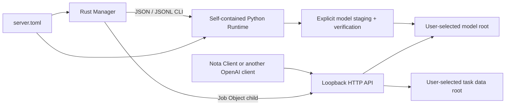

# ADR 0013: Standalone Windows Runtime and Manager

- Status: Accepted; distribution layer superseded by ADR 0014
- Date: 2026-08-18

## Context

Nota Client talks to an OpenAI-compatible ASR endpoint and must remain
independent from one particular server implementation. Ordinary Windows users,
however, cannot reasonably be expected to install Python, uv, Git, PyTorch, and
the Server's dependencies before transcription works. Bundling model weights
inside every release would make the installer too large and would blur model
license and upgrade boundaries.

## Decision

The Server repository owns a Windows 11 x64 CPU product with four layers:

1. a versioned `server.toml` and JSON/JSONL CLI contract;
2. a movable one-folder Runtime containing CPython and locked CPU dependencies;
3. a native Rust Manager that owns a current-user Server child process; and
4. a per-user NSIS Setup built locally by the project owner.

Runtime and Setup contain no model weights. The Manager calls the Python CLI for
model listing, installation, verification, and diagnosis, so the Rust UI never
duplicates the model catalog. Models and task data may live outside the program
directory. Relative TOML paths are resolved from the TOML file, while Manager
updates preserve unknown keys and comments in that same file.

The Manager does not register a Windows service. It uses a Job Object so its
owned child cannot survive a real Manager exit, but closing the window merely
hides it in the notification area. An already-running external Server is
reported and never terminated. Default Windows configuration binds only to
`127.0.0.1`; source, Docker, and systemd deployments retain their explicit
network settings.

## Consequences

- Nota Client needs no repository-specific installer or process-management code.
- Runtime upgrades replace program files without replacing configuration,
  models, caches, or meeting data.
- A model download may be resumed, but only a verified snapshot becomes
  installed. Mutable upstream revisions require the catalog's recorded file
  count and aggregate SHA-256.
- The ordinary release target is CPU-only and online-model-only. XPU packages,
  Windows services, automatic updates, remote management, and release CI are
  outside this decision.
- Formal Setup artifacts must be signed. Local development can explicitly build
  an unsigned installer for testing, but the repository never uploads it.
- Windows Python, Rust, CPython standalone, NSIS, and model inventories remain
  separate compliance boundaries.
