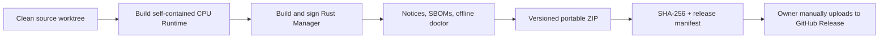

# ADR 0014: Portable ZIP Windows Distribution

- Status: Accepted
- Date: 2026-08-19
- Supersedes: ADR 0013's per-user Setup distribution layer

## Context

The self-contained Windows Runtime and native Manager are already movable as
one folder. For the foreseeable release cycle, the project owner wants to build
the official CPU package locally and upload it manually to GitHub Releases.
Maintaining an installer adds upgrade, uninstall, signing, and user-data
semantics that are not needed while the product is distributed as a portable
tool.

## Decision

The only official ordinary-user Windows artifact is:

```text
Nota-ASR-Runtime-<version>-Windows-x64-CPU.zip
```

It contains one versioned top-level folder with the self-contained Python
Runtime, native Manager, configuration template, launchers, legal inventories,
and empty model/data/log directories. It contains no model weights. The owner
runs `scripts/build-windows-release.ps1` from a clean worktree; the script signs
the Manager unless explicitly building an unsigned local test package, performs
offline diagnosis, creates the ZIP, and emits its SHA-256 and release manifest.
It does not upload the artifact and is not run by CI.

Portable and installed configuration modes are distinguished by an explicit
program-directory marker:

- without `.nota-installed`, Manager uses adjacent `config/server.toml`;
- with `.nota-installed`, a future installed build uses
  `%APPDATA%\NotaASR\server.toml`;
- an explicit `--config` argument overrides either default.

A future installer must create the marker, but no installer implementation is
part of the current release path or official product.



## Consequences

- Ordinary users extract one folder; no installation, administrator access,
  system Python, Windows service, firewall rule, or `PATH` change is required.
- A new version should be extracted to a fresh folder. Absolute external model
  and data roots can be reused directly; relative roots move with their
  portable folder and must be migrated or copied deliberately.
- The ZIP itself is authenticated by its published SHA-256. The Manager EXE is
  the code-signed executable inside a formal package.
- Installer upgrade and uninstall behavior are deferred. If an installed
  edition returns, its marker and `%APPDATA%` behavior must be tested separately
  without changing portable configuration ownership.
