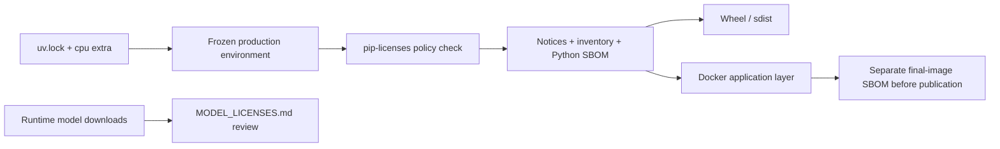

# Open-source compliance

## Scope

Nota ASR Server is MIT licensed. Third-party Python packages, operating-system
packages, container base layers, and downloaded model weights retain their own
licenses.

## Reproducible Python inventory

The supported CPU deployment is represented by the `cpu` project extra and
the committed `uv.lock`. Create the exact production environment and generate
the legal artifacts with:

```bash
uv sync --frozen --no-dev --extra cpu
uv run --no-sync python scripts/generate_license_artifacts.py --python .venv/bin/python
```

On Windows, pass `.venv/Scripts/python.exe`. The generator uses pinned
`pip-licenses 5.5.5`, applies `scripts/license-policy.json`, verifies reviewed
exceptions, and writes:

- `THIRD_PARTY_LICENSES.md`: package/version/license inventory;
- `THIRD_PARTY_NOTICES.txt`: full installed license texts;
- `bom.cyclonedx.json`: CycloneDX 1.6 Python production SBOM.

CI recreates the environment with `--frozen` and fails when policy or generated
files differ. Unknown, AGPL, SSPL, BUSL, GPL-3.0, and unreviewed LGPL packages
must not be accepted implicitly. A necessary exception must name one exact
package version, rationale, upstream source, and verified installed license
text.

## Distribution boundaries

- The wheel and source distribution include the project license, notice,
  third-party notices, inventory, and model-license guidance through PEP 639
  `license-files` metadata.
- The Docker image installs the frozen `cpu` extra and retains the same legal
  files under `/app`.
- The Python SBOM does not describe `python:3.12-slim`, Debian packages,
  FFmpeg, libsndfile, or their transitive native libraries. Before publishing
  an image, scan the final image into a separate OCI SBOM and review its
  licenses and CVEs. A source checkout or Python SBOM is not a substitute.
- Model snapshots are downloaded at runtime and governed by
  `MODEL_LICENSES.md`; they are never relicensed as MIT by this project.


