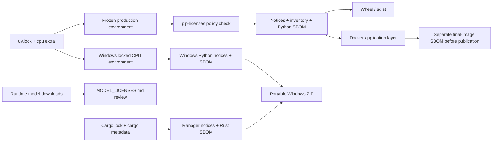

# Open-source compliance

## Scope

Nota ASR Server is MIT licensed. Third-party Python packages, operating-system
packages, container base layers, and downloaded model weights retain their own
licenses.

## Reproducible Python inventory

The supported release deployment is Linux CPU, represented by the `cpu`
project extra and the committed `uv.lock`. Generate the committed legal
artifacts inside the same Linux environment used by CI and the Docker image:

```bash
docker run --rm -v "$PWD:/workspace" -w /workspace \
  -e UV_PROJECT_ENVIRONMENT=/tmp/nota-license-venv \
  ghcr.io/astral-sh/uv:0.9.2-python3.12-bookworm-slim sh -lc \
  'uv sync --frozen --no-dev --extra cpu && uv run --no-sync python \
  scripts/generate_license_artifacts.py \
  --python /tmp/nota-license-venv/bin/python'
```

Do not regenerate the committed inventory from a Windows environment: optional
platform dependencies differ (`colorama` on Windows and `uvloop` on Linux).
The generator preserves the selected virtual-environment entry point instead
of resolving its Python symlink, so it cannot accidentally inspect CI runner
packages. It uses pinned `pip-licenses 5.5.5`, applies
`scripts/license-policy.json`, verifies reviewed exceptions, and writes:

- `THIRD_PARTY_LICENSES.md`: package/version/license inventory;
- `THIRD_PARTY_NOTICES.txt`: full installed license texts;
- `bom.cyclonedx.json`: CycloneDX 1.6 Python production SBOM.

The portable Windows CPU Runtime is a separate release inventory. Its local
builder calls the same policy generator with `--output-dir` against the
self-contained Windows interpreter and writes Windows-specific
`THIRD_PARTY_LICENSES.md`, `THIRD_PARTY_NOTICES.txt`, and
`bom.cyclonedx.json` under the Runtime's `legal/` directory. Those files must
not replace or masquerade as the committed Linux CPU inventory.

The release builder also records CPython 3.12.12 from Astral
`python-build-standalone`, the uv version used to assemble it, and the bundled
project license/notice. `cargo metadata --locked` drives a separate Rust
Manager inventory, full available crate license texts/notices, and CycloneDX
SBOM. Windows PowerShell compression and, when used, Windows SDK signing tools
are build tools recorded in the release manifest rather than merged into either
dependency graph. They are not distributed as dependencies inside the ZIP.

CI recreates the environment with `--frozen` and fails when policy or generated
files differ. Unknown, AGPL, SSPL, BUSL, GPL-3.0, and unreviewed LGPL packages
must not be accepted implicitly. A necessary exception must name one exact
package version, rationale, upstream source, and verified installed license
text.

## Distribution boundaries

- The wheel and source distribution include the project license, notice,
  third-party notices, inventory, and model-license guidance through PEP 639
  `license-files` metadata.
- The Docker image installs the frozen `cpu` extra and retains the same legal
  files under `/app`.
- The Python SBOM does not describe `python:3.12-slim`, Debian packages,
  FFmpeg, libsndfile, or their transitive native libraries. Before publishing
  an image, scan the final image into a separate OCI SBOM and review its
  licenses and CVEs. A source checkout or Python SBOM is not a substitute.
- Model snapshots are downloaded at runtime and governed by
  `MODEL_LICENSES.md`; they are never relicensed as MIT by this project.
- The portable Windows ZIP embeds the complete CPU Runtime and the native
  Manager but no model snapshot. Its Python, Rust, CPython, project, and
  model-guidance files remain visibly separate under `legal/`.


