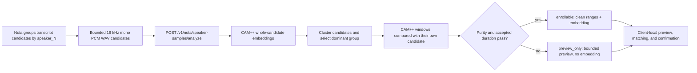

# Stateless Speaker Embedding Extraction

- Status: Accepted
- Last updated: 2026-08-03
- Owners: Nota maintainers

Nota ASR Server provides an authenticated, optional post-transcription
capability for extracting an anonymous CAM++ embedding from a bounded voice
sample. The desktop client owns names, matching, confirmation, and retention.

## Boundary

- The endpoint is independent of normal transcription and durable batch jobs.
- It accepts no person name, participant id, meeting id, or persistent sample
  id.
- The server does not store embeddings after the response and must not log
  audio, vectors, transcript text, or authentication data.
- Extraction failure must not affect a previously completed transcription.
- The model is lazy-loaded and shares the configured inference concurrency
  gate with ASR.

## Compatibility

Clients discover `speaker_embedding_version=1` from
`GET /v1/nota/capabilities`. Every response includes an extraction model name,
stable compatibility fingerprint, and vector dimension. Clients must compare
only vectors with the same fingerprint and dimension.

The endpoint accepts WAV containing exactly one 16 kHz mono PCM16 stream. The
configured byte and duration limits bound request memory and inference cost.
The canonical request, response, and error fields are documented in
`api-contract.md` and OpenAPI.

## Clean Sample Analysis

Clients discover `speaker_sample_analysis_version=1` before using
`POST /v1/nota/speaker-samples/analyze`. A request contains one to eight WAV
candidates that all came from transcript ranges carrying the same anonymous
`speaker_N` label. The combined input is limited to 30 seconds.

The analyzer first clusters whole-candidate CAM++ embeddings and selects the
dominant candidate group. Within that group it compares 1.5-second windows,
shifted by 0.75 seconds, with each window's own full-candidate embedding. It
then trims 0.5 seconds at detected changes and 0.25 seconds at outer clip edges
and ignores clean runs shorter than three seconds.

An `enrollable` result requires stable-window purity of at least 0.70 and at
least five seconds of accepted audio. Its final embedding is recomputed from
the accepted original ranges, so analysis windows that crossed a detected
boundary cannot enter the stored voiceprint. If the gates fail, the endpoint
returns `preview_only` with a bounded stable or fallback preview and no
embedding. This deliberately separates a user's ability to listen from the
stricter biometric enrollment decision.

The server advertises the accepted-duration and purity gates alongside the
candidate count and duration limits. Clients must use those advertised values
instead of duplicating thresholds in UI or enrollment code.

Returned ranges are relative to their multipart file. The server never sees
recording ids, transcript labels, participant names, or original meeting
timestamps. The client maps the selected preview back to its local recording.

See ADR 0007 for the ownership rationale and ADR 0008 for the clean-sample
policy.
