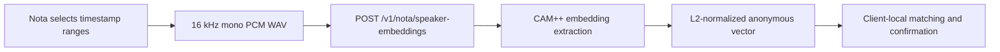

# Stateless Speaker Embedding Extraction

- Status: Accepted
- Last updated: 2026-08-02
- Owners: Nota maintainers

Nota ASR Server provides an authenticated, optional post-transcription
capability for extracting an anonymous CAM++ embedding from a bounded voice
sample. The desktop client owns names, matching, confirmation, and retention.

## Boundary

- The endpoint is independent of normal transcription and durable batch jobs.
- It accepts no person name, participant id, meeting id, or persistent sample
  id.
- The server does not store embeddings after the response and must not log
  audio, vectors, transcript text, or authentication data.
- Extraction failure must not affect a previously completed transcription.
- The model is lazy-loaded and shares the configured inference concurrency
  gate with ASR.

## Compatibility

Clients discover `speaker_embedding_version=1` from
`GET /v1/nota/capabilities`. Every response includes an extraction model name,
stable compatibility fingerprint, and vector dimension. Clients must compare
only vectors with the same fingerprint and dimension.

The endpoint accepts WAV containing exactly one 16 kHz mono PCM16 stream. The
configured byte and duration limits bound request memory and inference cost.
The canonical request, response, and error fields are documented in
`api-contract.md` and OpenAPI.

See ADR 0007 for the decision rationale.
